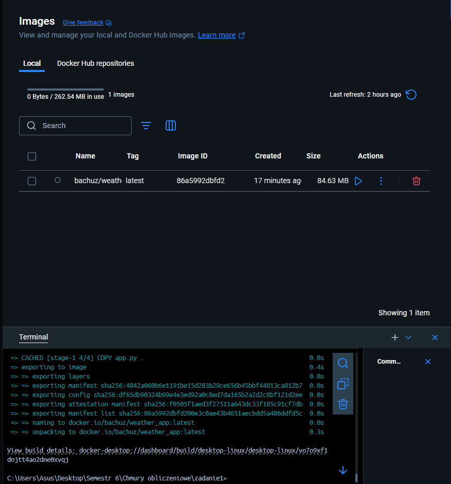
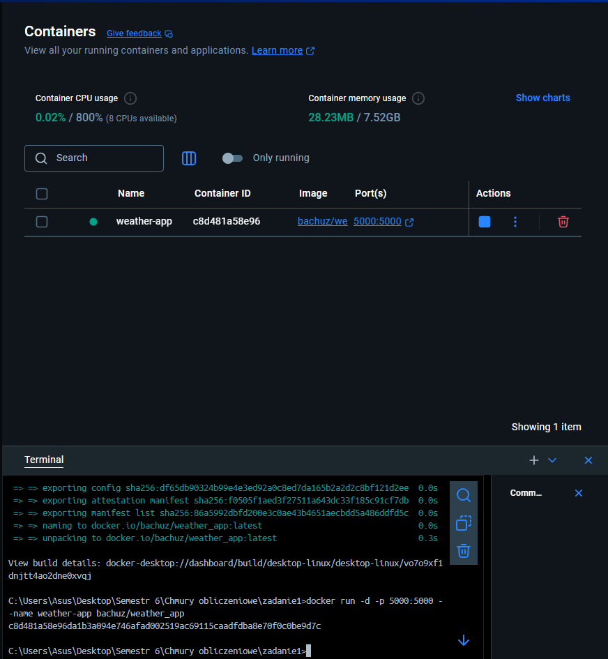
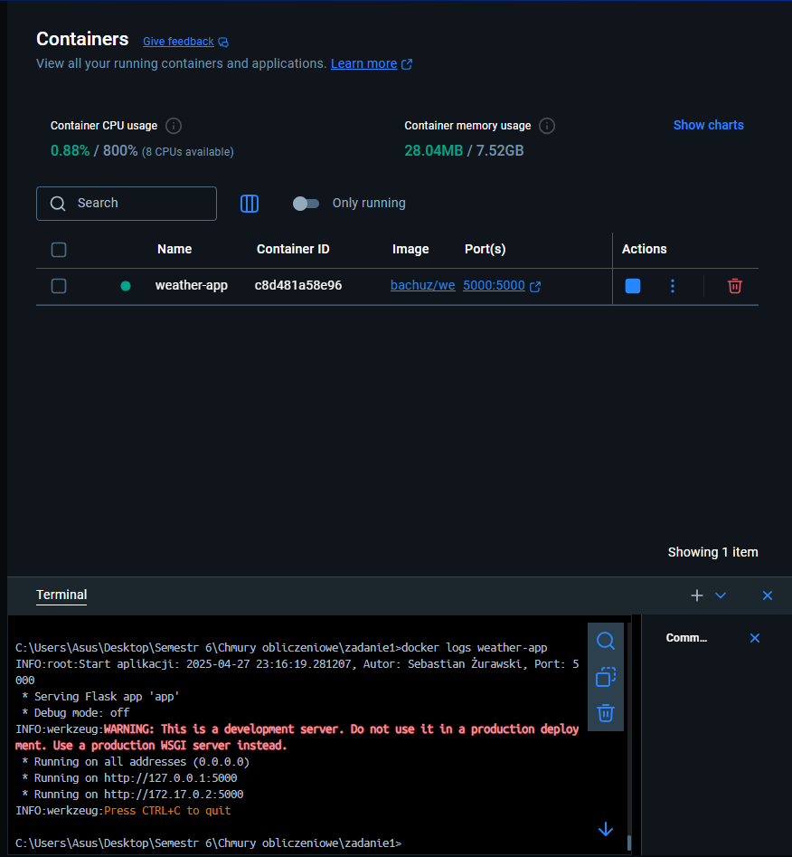
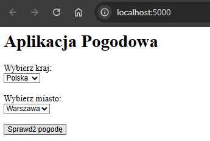
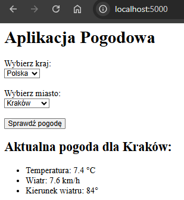
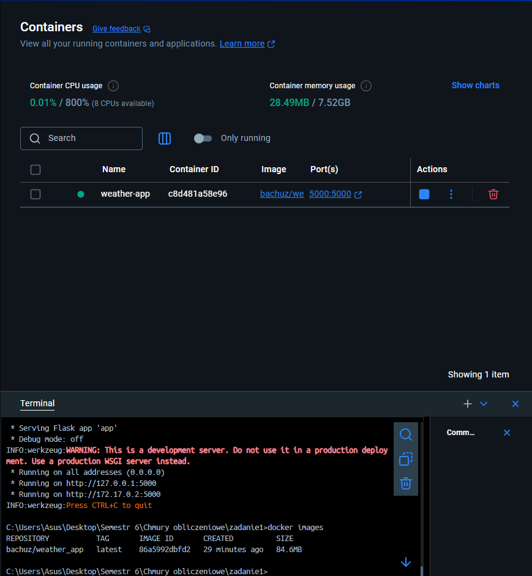
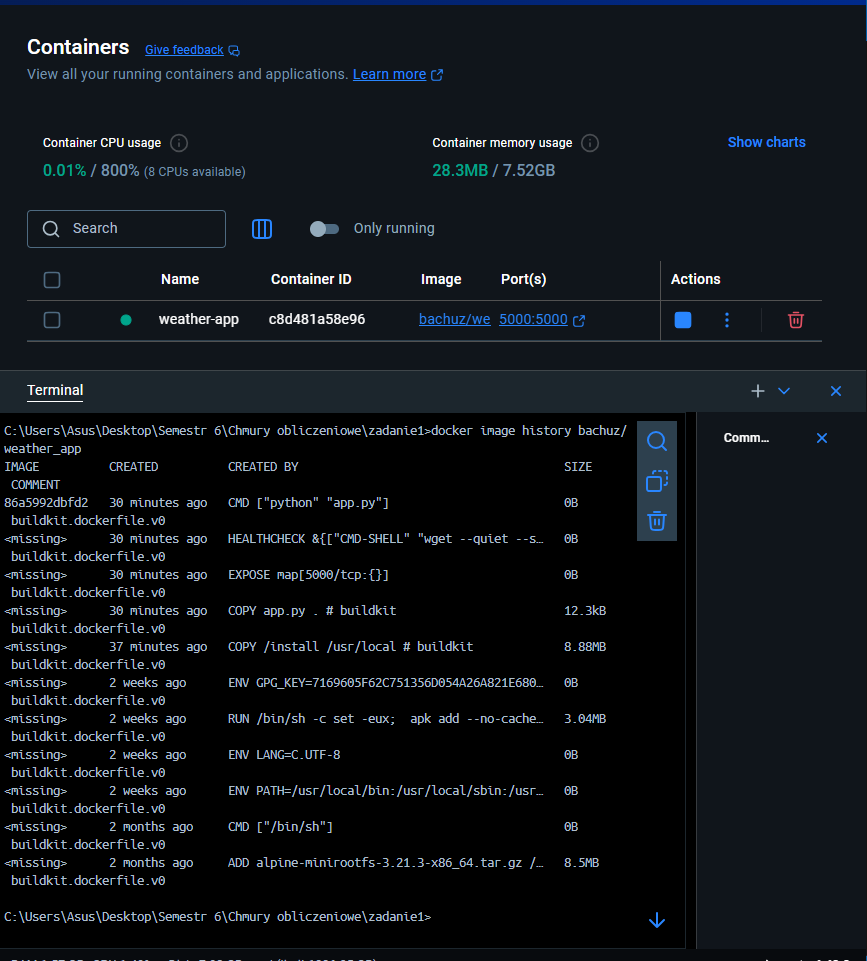

# Zadanie 1 - Programowanie aplikacji w chmurze obliczeniowej (Część Obowiązkowa)

Autor: Sebastian Żurawski

## Repozytorium GitHub:
https://github.com/bachuz13/zadanie1

## Obraz na DockerHub:
https://hub.docker.com/r/bachuz/weather_app

---

# 1. Opis działania aplikacji

Aplikacja umożliwia wybór kraju i miasta z predefiniowanej listy, a następnie wyświetla aktualną pogodę dla wybranej lokalizacji.

Po uruchomieniu kontenera, aplikacja zapisuje w logach:
- datę i godzinę uruchomienia,
- imię i nazwisko autora,
- numer portu TCP, na którym nasłuchuje.

---

# 2. Struktura projektu

- `app.py` – serwer aplikacji Flask
- `requirements.txt` – wymagane biblioteki (Flask, requests)
- `Dockerfile` – plik budujący obraz kontenera

---

# 3. Treść pliku Dockerfile

```Dockerfile
# syntax=docker/dockerfile:1.4

# Etap 1 - budowanie środowiska
FROM python:3.12-alpine AS builder
LABEL org.opencontainers.image.authors="Sebastian Żurawski"

WORKDIR /app
COPY requirements.txt .
RUN pip install --no-cache-dir --prefix=/install -r requirements.txt

# Etap 2 - finalny obraz
FROM python:3.12-alpine

WORKDIR /app

# Kopiujemy tylko zainstalowane rzeczy + aplikację
COPY --from=builder /install /usr/local
COPY app.py .

EXPOSE 5000

# Dodajemy healthcheck
HEALTHCHECK --interval=30s --timeout=5s --start-period=5s --retries=3 \
  CMD wget --quiet --spider http://localhost:5000 || exit 1

CMD ["python", "app.py"]
```

Opis:

-Wieloetapowe budowanie obrazu

-Minimalizacja rozmiaru

-LABEL autora (zgodny z OCI)

-Dodany HEALTHCHECK

# 4. Komendy używane podczas realizacji zadania

# 4.1 Budowanie obrazu

docker build -t bachuz/weather_app .

Opis: Buduje obraz na podstawie Dockerfile.

# 4.2 Uruchamianie kontenera

docker run -d -p 5000:5000 --name weather-app bachuz/weather_app

Opis: Uruchamia kontener i mapuje port 5000.

# 4.3 Sprawdzenie logów kontenera

docker logs weather-app

Opis:
W logach powinna pojawić się informacja:


# 4.4 Sprawdzenie rozmiaru obrazu

docker images

Opis: Rozmiar obrazu bachuz/weather_app

# 4.5 Sprawdzenie liczby warstw obrazu

docker image history bachuz/weather_app

Opis: Liczba warstw obrazu

# 5. Screenshoty

Dołączone screeny:

### Rys. 1. Budowanie obrazu (`docker build`)



### Rys. 2. Uruchamianie kontenera (`docker run`)



### Rys. 3. Logi uruchomienia (`docker logs`)



### Rys. 4. Formularz wyboru kraju i miasta



### Rys. 5. Wyświetlenie aktualnej pogody



### Rys. 6. Sprawdzenie rozmiaru obrazu (`docker images`)



### Rys. 7. Sprawdzenie liczby warstw (`docker image history`)



# 6. Uwagi końcowe
Projekt spełnia wszystkie wymagania zadania obowiązkowego.

Aplikacja poprawnie loguje informacje startowe.

Interfejs umożliwia wybór kraju, miasta i wyświetla aktualną pogodę.

Dockerfile jest zoptymalizowany i zawiera wymagane elementy.

# 7. Kod źródłowy aplikacji (app.py)

Poniżej przedstawiono pełny kod aplikacji wraz z komentarzami:

```python
from flask import Flask, request, render_template_string
import datetime
import requests
import logging
import json

# Tworzenie instancji aplikacji Flask
app = Flask(__name__)

# Ustawienia
PORT = 5000
AUTHOR = "Sebastian Żurawski"

# Konfiguracja logowania informacji startowych
logging.basicConfig(level=logging.INFO)
logging.info(f"Start aplikacji: {datetime.datetime.now()}, Autor: {AUTHOR}, Port: {PORT}")

# Predefiniowana lista krajów i miast
cities = {
    "Polska": ["Warszawa", "Kraków", "Gdańsk"],
    "USA": ["New York", "Los Angeles", "Chicago"],
    "Niemcy": ["Berlin", "Monachium", "Hamburg"]
}

# Funkcja pobierająca aktualną pogodę dla wybranego miasta
def get_weather(city):
    url = f"https://geocoding-api.open-meteo.com/v1/search?name={city}&count=1"
    geo = requests.get(url).json()
    if geo.get('results'):
        lat = geo['results'][0]['latitude']
        lon = geo['results'][0]['longitude']
        weather_url = f"https://api.open-meteo.com/v1/forecast?latitude={lat}&longitude={lon}&current_weather=true"
        weather = requests.get(weather_url).json()
        return weather.get('current_weather', {})
    return {}

# Główna strona aplikacji
@app.route("/", methods=["GET", "POST"])
def index():
    selected_country = "Polska"
    selected_city = None
    weather = None

    # Obsługa formularza POST
    if request.method == "POST":
        selected_country = request.form.get("country")
        selected_city = request.form.get("city")
        if selected_city:
            weather = get_weather(selected_city)

    # Dynamiczne tworzenie opcji dla krajów
    country_options = ''.join([
        f'<option value="{country}" {"selected" if country == selected_country else ""}>{country}</option>'
        for country in cities.keys()
    ])

    # Dynamiczne tworzenie opcji dla miast
    city_options = ''.join([
        f'<option value="{city}" {"selected" if city == selected_city else ""}>{city}</option>'
        for city in cities.get(selected_country, [])
    ])

    # Generowanie sekcji z informacjami pogodowymi
    weather_info = ""
    if weather:
        weather_info = f"""
        <h2>Aktualna pogoda dla {selected_city}:</h2>
        <ul>
            <li>Temperatura: {weather.get('temperature', '?')} °C</li>
            <li>Wiatr: {weather.get('windspeed', '?')} km/h</li>
            <li>Kierunek wiatru: {weather.get('winddirection', '?')}°</li>
        </ul>
        """

    # HTML strony z dynamicznym formularzem i wynikami
    return render_template_string('''
    <h1>Aplikacja Pogodowa</h1>
    <form method="POST">
        <label for="country">Wybierz kraj:</label><br>
        <select name="country" id="country" onchange="updateCities()">
            {{ country_options|safe }}
        </select><br><br>

        <label for="city">Wybierz miasto:</label><br>
        <select name="city" id="city">
            {{ city_options|safe }}
        </select><br><br>

        <button type="submit">Sprawdź pogodę</button>
    </form>

    {{ weather_info|safe }}

    <script>
    const cities = {{ cities|tojson }};
    function updateCities() {
        const country = document.getElementById('country').value;
        const citySelect = document.getElementById('city');
        citySelect.innerHTML = "";
        cities[country].forEach(function(city) {
            let option = document.createElement('option');
            option.value = city;
            option.text = city;
            citySelect.appendChild(option);
        });
    }
    </script>
    ''', country_options=country_options, city_options=city_options, weather_info=weather_info, cities=cities)

# Uruchomienie serwera Flask
if __name__ == "__main__":
    app.run(host="0.0.0.0", port=PORT)

```
